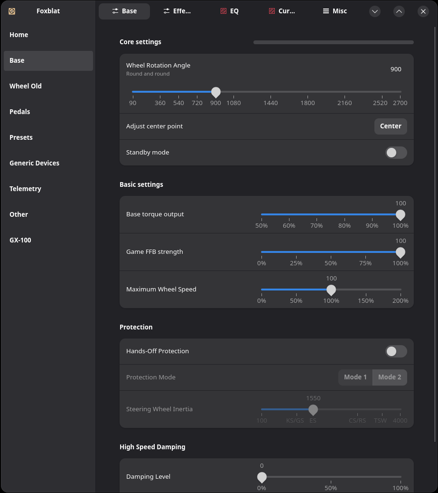
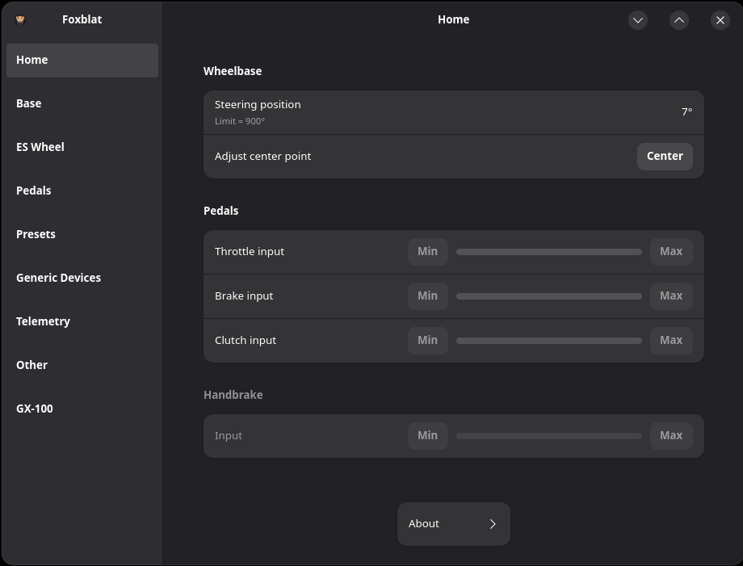
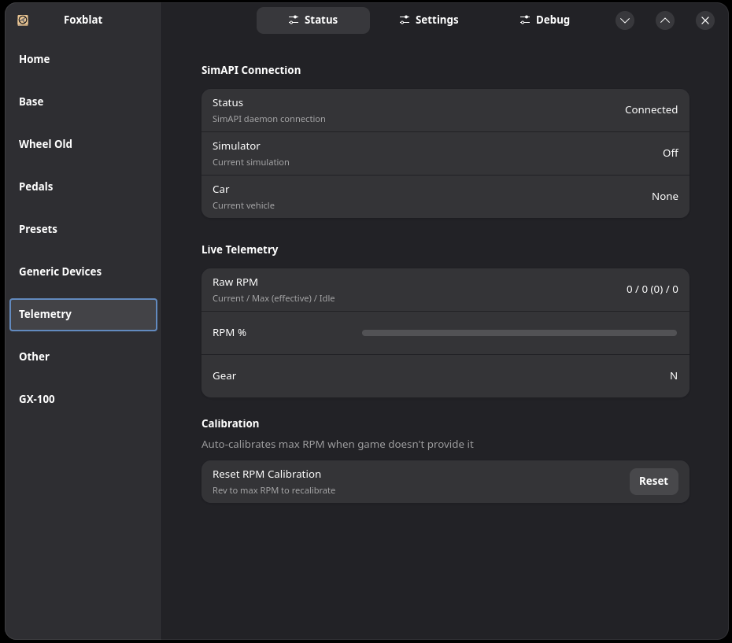
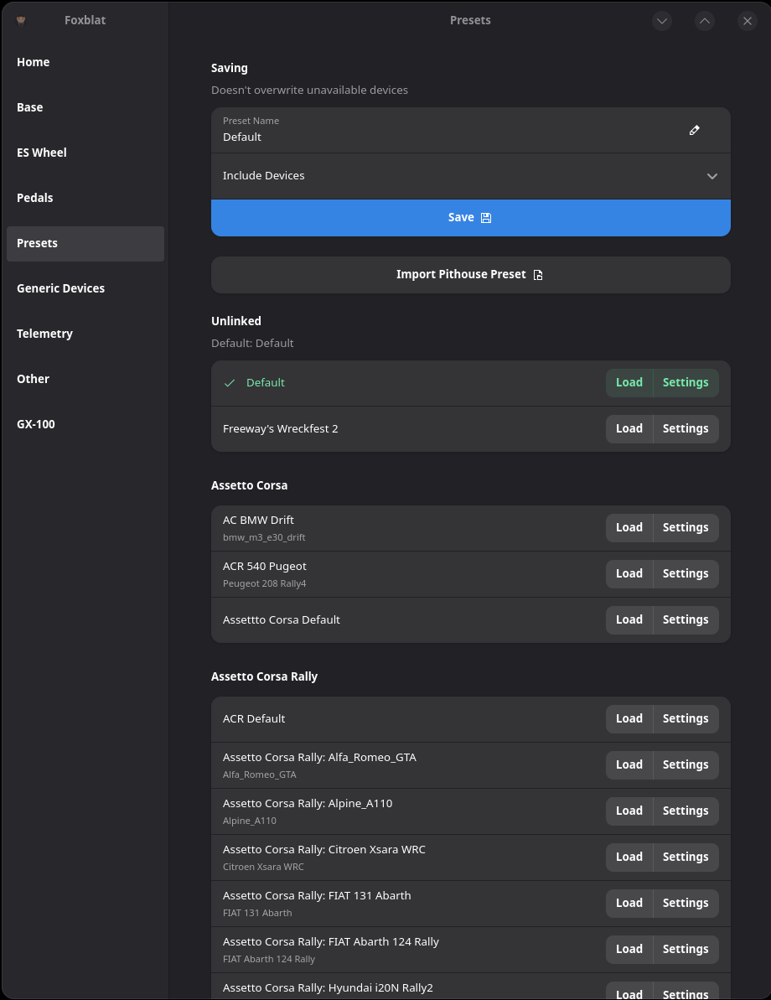
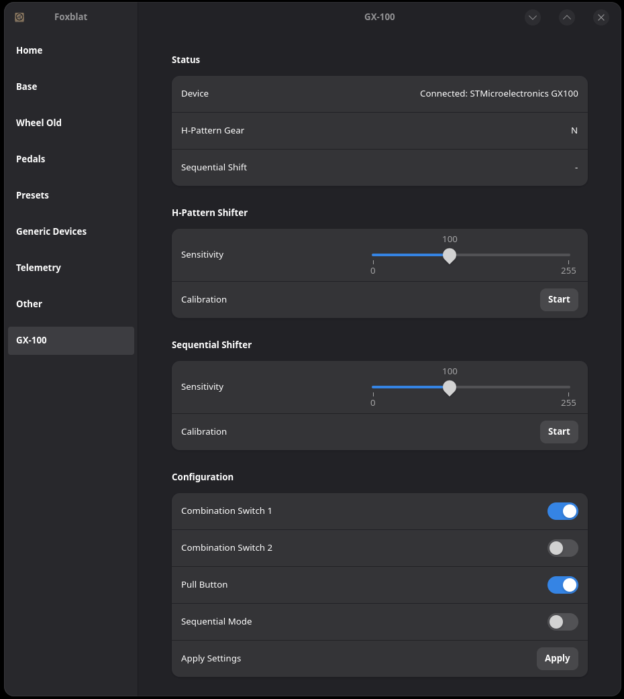

# Foxblat
Foxblat for Moza Racing. Control your Moza gear settings... and more!

> [!NOTE]
> This is a fork of the excellent [Boxflat by Lawstorant](https://github.com/Lawstorant/boxflat).  If you enjoy this project, please [sponsor](https://github.com/sponsors/Lawstorant) the original author of this program.

> [!WARNING]
> This fork is for experimental features not found in the original.



Flatpack coming soon 

> [!NOTE]
> [Sim Racing On Linux](https://simracingonlinux.com/)

> [!WARNING]
>For moza ffb driver, check out [universal-pidff](https://github.com/JacKeTUs/universal-pidff) by [@JacKeTUs](https://github.com/JacKeTUs)
>
>Not needed for 6.15+ as it was upstreamed and backported to 6.14.3, 6.13.12, 6.12.24.

## Functionality

Foxblat provides the following additional features:
* Telemetry support via Simd/SimAPI: https://github.com/Spacefreak18/simapi
* Presets can be saved on extended paths, not limited to process name only
* Presets can be saved by vehicle (When [simd](https://github.com/Spacefreak18/simapi) is running)
* A plugin system has been developed to extend support for additional devices
  * [Read the plugin documentation here](plugins/README.md)
  * An example plugin for the Aliexpress GX-100 shifter is included, linux users need [this driver](https://github.com/JacKeTUs/hid-gx100-shifter)
* UDP control.  Load a preset or set steering angle remotely.
  * [Read UDP documentation here](examples/IPC_README.md)
* Importing Pithouse JSON presets is supported

### Firmware upgrades
Not supported at this time.

## Compatibility
Moza commands and their protocol is hardware agnostic, so any implemented feature should work with any wheelbase, wheel, pedal set etc. Some Wheel settings are device-specific (FSR Wheel dashboard for example)

Wheel indicator blinking colors can't be read from the wheel. This is a limitation of the current firmware.

Foxblat automatically detects is a device (shifter/pedals) needs a detection fix and creates a proper virutal device. This fixes game detection.

> [!TIP]
> Detection fix can be applied to any HID device as well (pedals, shifters, button boxes).

# Installation

### Udev rule installation for flatpak
Copy this into terminal and execute with root permissions
```bash
sudo tee /etc/udev/rules.d/99-foxblat.rules <<< 'SUBSYSTEM=="tty", KERNEL=="ttyACM*", ATTRS{idVendor}=="346e", ACTION=="add", MODE="0666", TAG+="uaccess"'
```

> [!IMPORTANT]
> Unplug and plug in your deivce to trigger these new rules. Alternatively, you can reboot your system.

## Flatpack
Coming Soon

## Arch Linux:
Coming soon

## Void Linux:
Coming soon 

## Manual:
This package depends on:
- python >= 3.11
- gtk4
- libadwaita >= 1.6
- cairo 1.18
- gobject-introspection
- pkexec (optional)

Python dependencies:
- pyyaml 6.0.2
- psutil 6.1.0
- pyserial 3.5
- pycairo 1.27.0
- PyGObject 3.50.0
- evdev 1.7.1
- trayer 0.1.1
- dbus-python 1.4.0


```bash
# Just run:
$ ./entrypoint.py --local
# or
$ python3 entrypoint.py --local
```
Installation:
```bash
# Run `install.sh` with root permissions.
$ sudo ./install.sh
# Application will be installed as `foxblat`
$ foxblat
```
Removal:
```bash
# Run `install.sh remove` with root permissions.
$ sudo ./install.sh remove
```

# Troubleshooting
Below are some common problems and possible solutions:
- `Error getting authority` when adding/updating the udev rules: make sure
  the `dbus` service is running
- Wheelbase does not appear, `dmesg` shows it connecting and getting assigned
  an USB device, but it doesn't show up in foxblat -- check the `/dev` folder
  with `ls /dev/ttyACM*`, if there is nothing you might be missing the
  `CDC ACM` serial driver in the kernel
- There is no FFB - if your torque is up to 100%, try turning it down to 95%
  and turn the wheelbase off and on again

# Some more screenshots








## Supporters

If you enjoy this project, please [sponsor](https://github.com/sponsors/Lawstorant) the original author of this program.

**Original Boxflat © 2025 Tomasz Pakuła Using Arch BTW**
